# Introduction
## Motivation
Home Assistant has proven to be a very powerful solution in home automation, so we'd like to use its power even when we're offline.  
Imagine a scenario where you have no internet, and you'd like to control your home and have all of your automations ready. For some time, there was a problem with that.
The underlying Operating System that is used to run our version of Home Assistant *(Home Assistant OS)* **needs to know the current time to boot up**.
The usual way Home Assistant OS knows the time is by connecting to the internet and getting the time from an [**NTP Server**](https://en.wikipedia.org/wiki/Network_Time_Protocol). 
### So What If We Don't have Internet?
We have 2 options:
* Get the time from a local NTP server *(instead of a server on the internet)*
* Use a [Real Time Clock](https://en.wikipedia.org/wiki/Real-time_clock) to keep track of time

# Local NTP Server
Most PCs contain a Real Time Clock which keeps track of the passage of time, even when the PC is shut down. We can use this property to share this clock with Home Assistant through the local network, instead of connecting to the internet.
We will create our NTP server on a Windows machine connected to the network to act as an NTP Server. Then, we will set Home Assistant to connect to this local NTP server if it can't connect to the internet.
**_Note:_ The Windows machine must be running and connected to the network for Home Assistant to connect to it.**

## Creating the Windows NTP Server
We will run through a series of steps to create our windows NTP server. It's simple, just follow these steps.

### Setting up Server
1. **<a name="open_services"></a>Open Services.**  
     <a name="services"></a>Press _Windows + R_ and type `services.msc` **_or_** press the windows key and search for **Services**.  
    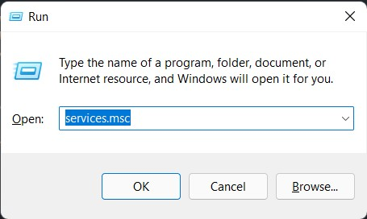 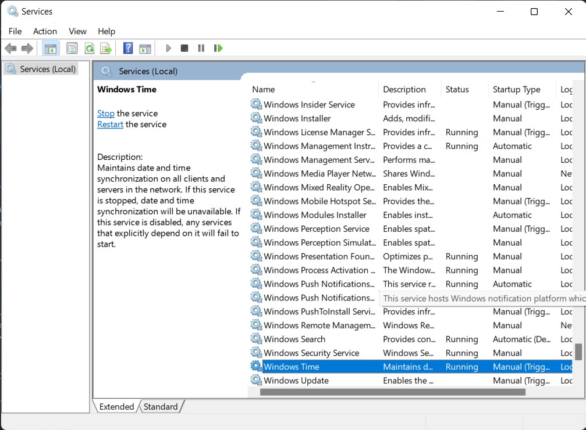
2. **Stop the "Windows Time" Service.**   
     Scroll down to the "Windows Time" Service. **Right click** on it and press **stop**.  
    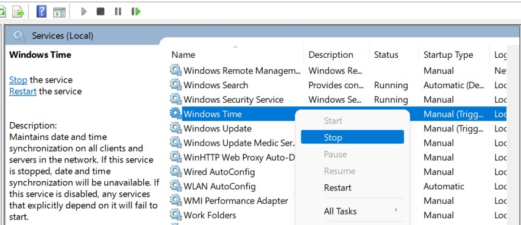
3. **Open Registry.**   
    Press _Windows + R_ and type `regedit` **_or_** press the windows key and search for **Registry Editor**.  
    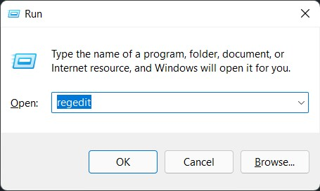 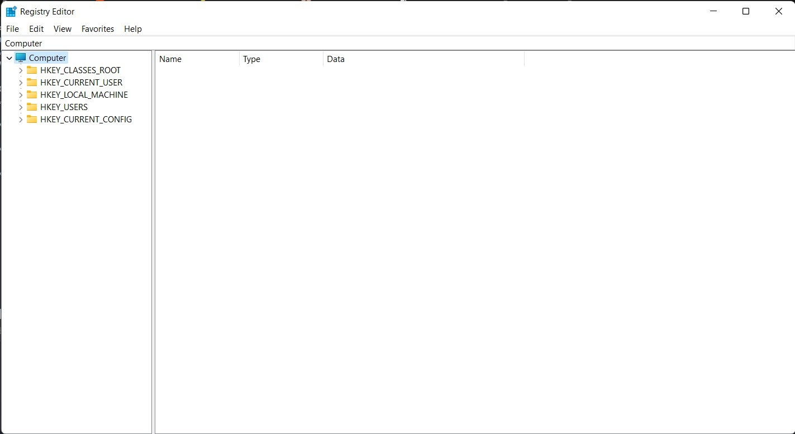
4. **Make Address Bar Visible.**   
    Click on **View** and make sure that **"Address Bar"** is checked.  
    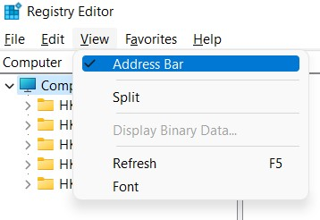
5. **Go to NTP.**   
    **Enter** the following address in the **Address Bar**.  
    `HKEY_LOCAL_MACHINE\SYSTEM\CurrentControlSet\Services\W32Time\TimeProviders\NtpServer`  
    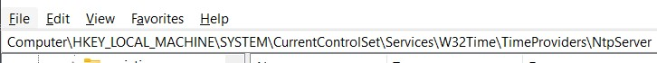
6. **Enable.**   
    Double click on **"Enable"** and change the **"Value data" to 1**.  
    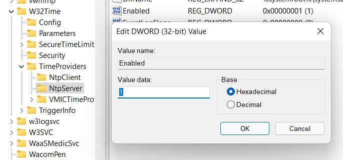
7. **Go to Config.**   
    **Enter** the following address in the **Address Bar** .  
    `HKEY_LOCAL_MACHINE\SYSTEM\CurrentControlSet\services\W32Time\Config`  
8. **Set AnnounceFlags.**  
    Double Click on **"AnnounceFlags"** and **"Value data" to 5**.  
    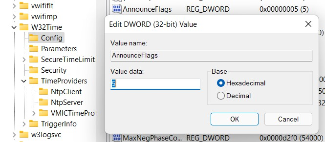
9. **Go to Local NTP.**  
    **Enter** the following address in the **Address Bar**.
    `HKEY_LOCAL_MACHINE\SYSTEM\CurrentControlSet\Services\W32Time\Parameters`
10. **Set Local NTP.**  
    Double click on **LocalNTP** and change the **"Value Data" to 1**. <a name="localntp"></a>  
    _If you can't find "LocalNTP":_
      - **Right click** in an empty space and click **New > DWORD (32-bit) Value**.  
          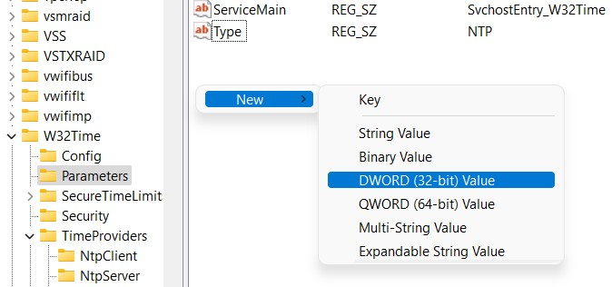 DWORD" width="300"/>
      - **Set name** to **`LocalNTP`** (without spaces/case sensitive).  
          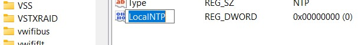
      - Change Value Data to 1 like [above](#localntp)
11. **Run the "Windows Time" Service.**   
    [Open Services](#open_services), right click on the **"Windows Time" service** and click **start**.  
    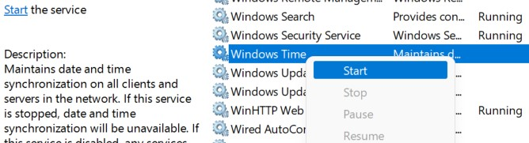

**Recommended: _If the NTP Server stops after some time, you can try to try the [additional troubleshooting steps](#additional-troubleshooting-steps)_**
 
### Allowing Server Through Firewall
Till now, we've created the server. However, **the firewall blocks the NTP server** from being broadcasted to other devices. We have to allow the NTP server through the firewall for it to be discoverable.  


1. **Open Windows Firewall.**  
    Press _Windows + R_ and type `wf.msc` **_or_** press the windows key and search for **Windows Defender Firewall with Advanced Security**.  
    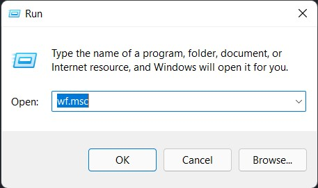 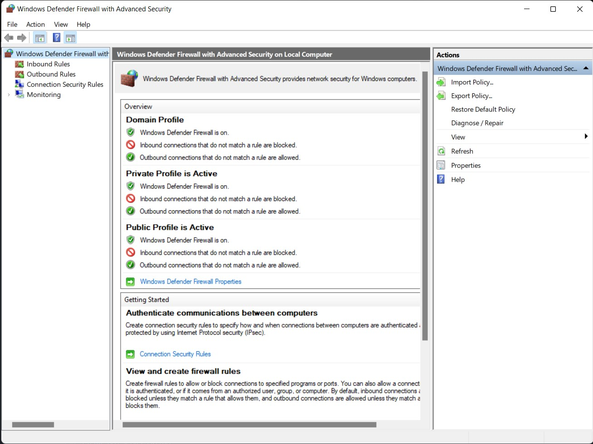
2. **Add an Inbound Rules.**  
    Click on **"Inbound Rules"** on the far left then click **"New Rule"** on the far right.  
    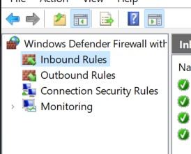 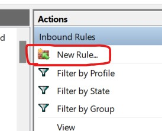
3. **Setup Inbound Rule.**<a name="setup_rule"></a>  
   - Check **Port** and then **Next**  
     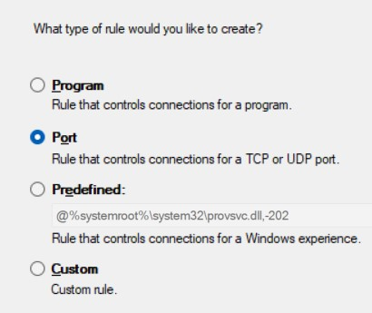
   - Check **UDP** and specify port to be **`123`** then click **Next**  
     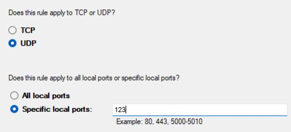
   - Check **Allow the Connection** and click **Next**  
     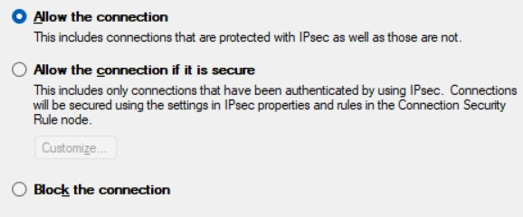
   - Check _all options_ then click **Next**  
     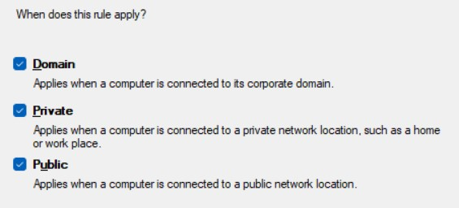
   - Name it anything you want (e.g.: `UDP Incoming 123`) then click **Finish**
4. **Add an Outbound Rule.** 
   Click on **"Outbound Rules"** on the far left then click **"New Rule"** on the far right.  
   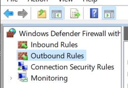 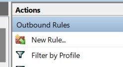  
5. **Setup Outbound Rule.**  
   Follow the same steps as the [Inbound Rule](#setup_rule)
   
------------------------
Now the this PC will always be broadcasting it's current time **to the local network as long as it's running**. We should know the IP Address of the PC so that we can connect to it using Home Assistant.

### Knowing the NTP Server's IP Address
Knowing the IP Address is as simple as typing a command in the cmd.  
1. Press _Windows + R_ and type `cmd` **_or_** press the windows key and search for **cmd**. 
2. In the Command Prompt, type `ipconfig` and press Enter.
3. You will find `IPv4 Address. . . . . . . . . . . : XXX.XXX.X.XXX`. This is the PC's IP Address, which is also the NTP Server's IP Address (as the server is the PC). <a name="ip_address"></a>

Take note of this IP Address. This is the one that Home Assistant will connect to.

### Making the IP Address Static
Making the IP Address Static is the same as reserving an IP Address for the PC so that it doesn't change. This is extremely important as we will configure Home Assistant
to connect to a single IP Address. If the PC is restarted, it may take a different IP Address so making it static will force the PC to take the same IP Address every time it connects to the network.

To make your IP Address static, follow the guide [here](https://www.hellotech.com/guide/for/how-to-set-static-ip-windows-10)  
When choosing an IP Address to set, it's best to set it as the IP Address that you found [here](#ip_address). This ensures that you're not choosing an IP Address that is being used by another device.

### Additional Troubleshooting Steps
<details>
  <summary>View Steps</summary>

  Sometimes after the server is up and running, it can stop working for no reason. There are some steps we can do to make sure that the server stays up and auto restarts if there is a problem
  1. Open **"Services"** like [here](#open_services)
  2. Scroll down to **"Windows Time"** and **double click on it**.  
     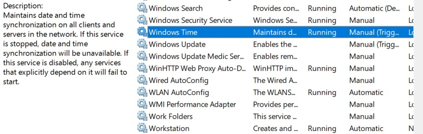
  3. Set "Startup Type" to **Automatic**.  
     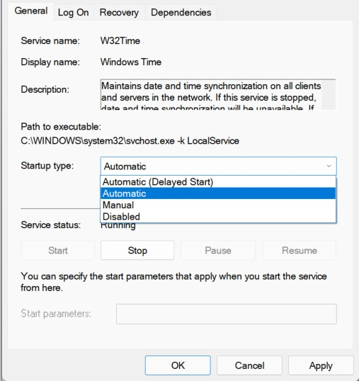
  4. Click **Recovery tab** at the top and make sure that all are set to **"Restart the Service"** and click **OK**.  
     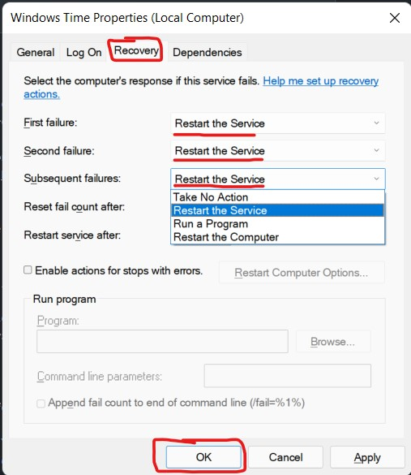
</details>

## Testing the NTP Server
If you want to test your NTP Server to make sure it's running, you can do it from a **different** phone or a PC connected to the **same network**. This step is important to ensure that the NTP server is running with no mistakes during setup.
- For a PC, follow the guide [here](https://www.windowscentral.com/how-manage-time-servers-windows-10)  
  In the **"server"** field, enter the IP Address of the NTP server you obtained earlier. You should click "Update Now" and wait for it to synchronise. If it doesn't work, try to test it on a phone.
- For a phone, you can download [this app for android](https://play.google.com/store/apps/details?id=com.treeteam.ntp.time) and [this app for IOS](https://apps.apple.com/us/app/atomicclock-ntp-time/id1402993049?app=itunes&ign-mpt=uo%3D4).  
  Open settings > (custom time server for IOS) > server setting and enter the server address as the IP Address of the NTP server you obtained earlier.  
  You should wait a couple of seconds until it syncs to the server. If it can't sync, it will display an error. If it syncs, you should see the clock updating normally infront of you
  
## Setup Home Assistant to Use Local NTP Server
If all the above steps were successful (or you have another method for an NTP Server), you should now setup Home Assistant to use the local NTP server we just created.  
This step is a bit involved, but it's easy nontheless.  
### Requirements
- USB Drive
- SD Card Reader (for testing and confirming the configuration) (optional)
- [Linux Reader](https://www.diskinternals.com/linux-reader/) (for testing and confirming the configuration) (optional)
- IP Scanner (to check if Home Assistant has booted) (optional)
- Device with Home Assistant on it (Surely)
### Backup
Before changing any configuration, be sure to backup your Home Assistant before starting to be able to restore it later if it didn't boot up.
You can check more about backups/snapshots [here](https://www.home-assistant.io/common-tasks/os/#backups). Note that new versions of Home Assistant call it "Snapshot" instead of "Backup".  
### Configuration
To change the NTP server Home Assistant uses to sync its time, you need to use a USB drive. This configures the network options for Home Assistant. For a list of all configuration options, check [here](https://github.com/home-assistant/operating-system/blob/dev/Documentation/configuration.md).

#### Configure USB Drive
1. Format a USB drive with FAT32/EXT4/NTFS and name it CONFIG (in all capitals).
2. Create an empty file and name it `timesyncd.conf` in the USB drive.
3. In the `timesyncd.conf` file, add the following: <a name="timesync_contents"></a>
    ```
    [Time]
    NTP=time.cloudflare.com XXX.XXX.XXX.XXX
    FallbackNTP=0.pool.ntp.org 1.pool.ntp.org 2.pool.ntp.org 3.pool.ntp.org
    ``` 
4. Instead of the `XXX.XXX.XXX.XXX`, put the IP Address of your NTP Server.
   If you have several NTP servers, you should add them one after another, with a single space in between.
   This configures home assistant to use the [cloudflare NTP server](https://www.cloudflare.com/time/) and then use your local NTP server in case it can't connect to the internet.
5. Save the file.
6. Safely eject the USB drive.

### Configure Home Assistant
You'd want to configure Home Assistant to read the configuration file you just created.
1. Unplug Home Assistant from power (or shut it down).
2. Plug the USB drive in a **USB 2** port on the device running Home Assistant.
3. Plug in Home Assistant and wait for it to boot.
4. Open an IP Scanner and check if Home Assistant has booted (optional)
   To know if Home Assistant has booted, you should see the name of the Home Assistant pop up in the IP Scanner.
5. Unplug the USB drive  

At this point, you would be able to open up the Home Assistant UI. When that happens, you should have it all configured.  
To make sure that the configuration has been successfully applied to Home Assistant, you should try the [following steps](#testing-configuration-optional).
   
### Testing Configuration (optional)
There is no indication of whether the configuration has been successfully applied to Home Assistant. To check if the configuration has been applied, you would need to check the files inside the SD Card used for Home Assistant.
1. Download Linux Reader from [here](https://www.diskinternals.com/linux-reader/).
2. Plug in the SD Card using an SD Card reader.
3. Open Linux Reader
4. Make sure that Address Bar is visible. Click on View and make sure that **Address Bar** is checked.  
   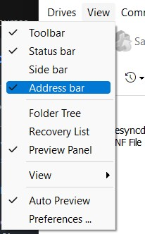
5. **Open** the following **directory**.  
    `/var/lib/systemd\etc\systemd\`
    - Paste it in the Address Bar or
    - Follow the GUI to reach this path
   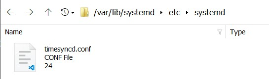
6. Single **click** on `timesyncd.conf` and make sure that the contents of the file is the same as you set [here](#timesync_contents)  


If the contents are the same, then congratulations! You have successfully set up a local NTP server, and Home Assistant has access to it.  
If the contents aren't the same, you should repeat [the configuration] and make sure you followed the steps correctly.


