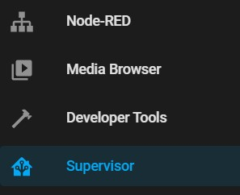
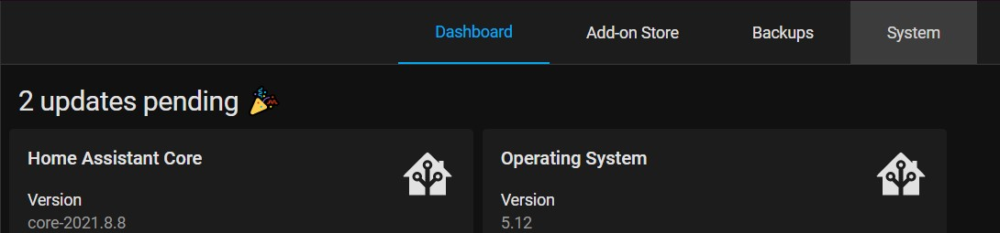
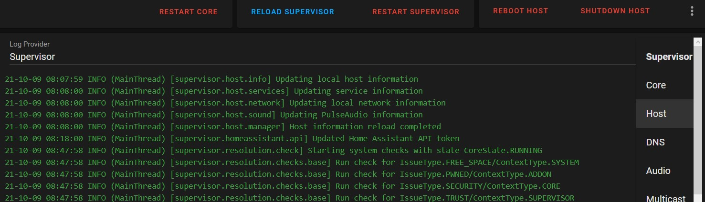

# Introduction
Home Assistant works best when it's connected to the internet. It can control devices remotely, it can gather info from various services and it **needs** to synchronise the time with a web server (NTP Server).  
The problem comes when we are in an offline environment. I would personally like to have full control of my home even when I'm offline.  
From my testing, Home Assisstant OS can boot up even if there is no internet. However, it doesn't always boot up properly. This means that there are some add-ons missing in the supervisor and the supervisor doesn't work correctly.  

## The Real Problem
The real problem with not having internet is getting the time from the internet. The Raspberry Pi usually doesn't have a built-in clock to know the time. Once it's turned off, the clock inside the Pi stops
and needs to be readjusted the next time it boots up. This causes a problem with any automations. For example, I've set my alarm to wake me up at 8 AM. In this scenario, I have no internet. Imagine that I had a power outage for
an hour and a half. The Pi thinks that the clock is 8 AM, when in reality it is 9:30 AM. By this time, I would've missed my bus, or work. Now you might see why this is a problem.  

# The RTC
The RTC is an abbreviation for *Real Time Clock*. This is simply a device that is inside most computers which is always running and consumes very little power. This causes it to be a **real** time clock.
It keeps track of time at all times, so it always has some accurate estimation of the real time. There are cheap **RTC modules that are sold in electronic stores**.  
The good thing is: Raspberry Pis support connecting an RTC. The bad thing is: Home Assistant OS doesn't support syncing time from an RTC. It has to be done manually.

## RTC and Raspberry Pi
There are RTCs designed to be used with a Raspberry Pi. These can be used right away without any additions. Just open up the datasheet of the module and see how it can be connected.
Or simply google "How to connect XXX to Raspberry Pi".  
The RTC module we had was not designed for the Raspberry Pi so we had to do some modifications to it. This would require some knowledge in soldering and desoldering.

[This is the exact model of the RTC module we had. (DS1307)](https://www.alibaba.com/product-detail/HW-111A-DS1307-Tiny-RTC-I2C_1600221142078.html?spm=a2700.galleryofferlist.normal_offer.d_title.33396f9eKbMuhA&s=p)

### Modifying the RTC
To make it compatible, we have to **remove** the small devices labelled **D1, R2, R3, R5 and R6** then make a **bridge** between the pads of **R6**. That's it. You've made it compatible with the Raspberry Pi.
To read more about why we did that, check [here](https://community.home-assistant.io/t/support-for-rtc-and-ntp-on-pi-ha-core/245207/14).

### Connecting the RTC

To connect the RTC, simply connect the pins as shown in the upper diagram. If you have a different Raspberry Pi model or don't know exactly how to connect it, search for Raspberry Pi pinout and see which pins you need to connect to. It's easy.

### Initialising RTC on HAOS
The hardware part is now over, we just need Home Assistant OS (HAOS) to recognise the connected device.  
For that, you just need an **SD-Card reader** and a **PC**.  
1. Remove the SD-Card which has Home Assistant on it from the Raspberry Pi and connect it to your PC using the SD-Card reader.
2. Open the SD-Card file
3. Open `**config.txt**` in the boot partition with any text editor
4. Add these lines to the end of the file:
    ```
    dtparam=i2c_vc=on
    dtparam=i2c_arm=on
    dtoverlay=i2c-rtc,ds3231
    ```  
  
_That's it!_
Now HAOS can recognise the connected device as an RTC!

### Testing the RTC
To test if the RTC is connected and is being read by HAOS, you need to open the supervisor.  
1. Open Supervisor  
   
2. Click on System Tab  
   
3. Change the log to "Host"  
   
4. Press `Ctrl+F` and search for "rtc".

If you find "rtc-..." then home assistant can read the RTC module.

### Syncing Real Time to the RTC
Before starting to use the RTC as is, we first need to set it's time as accurately as possible.  
This is a bit advanced, and it requires some tinkering with SSH. It doesn't require any SSH experience, but it's not straight forward.  
You need to setup access the root host like mentioned [here](https://developers.home-assistant.io/docs/operating-system/debugging/).  
Once root access is ok, you should SSH (e.g.: using PuTTY) to your Home Assistant like so:   
  `XXX.XXX.X.XXX:2222`  
Where XXX.XXX.X.XXX is the device's IP Address.  
Once you have access, type in the following command:  
  `hwclock -w` Sets the RTC time from the system (HAOS) time.  
To check if the time is correct or not, type in the following command:  
  `hwclock -r` Reads the RTC time.

# Additional Problems
After following the previous steps, there would still be a problem. The time doesn't sync automatically from the RTC to the system. In order to do it manually, we'd have to enter the command `hwclock -s`. This will change the System Time according to the RTC time. This works, but we have to do it every time we start HAOS.  
What's more, I'm not sure what will happen with the supervisor once the time syncs. Will some functionality also be missing? This needs further testing.
## Suggestions
My suggestion is to make a script that runs everytime HAOS starts. This has to do with linux and I haven't done enough research in it. I suggest that the command mentioned above `hwclock -s` is executed as a bash command everytime HAOS starts. This could help with the problem of syncing the time everytime HAOS starts.
